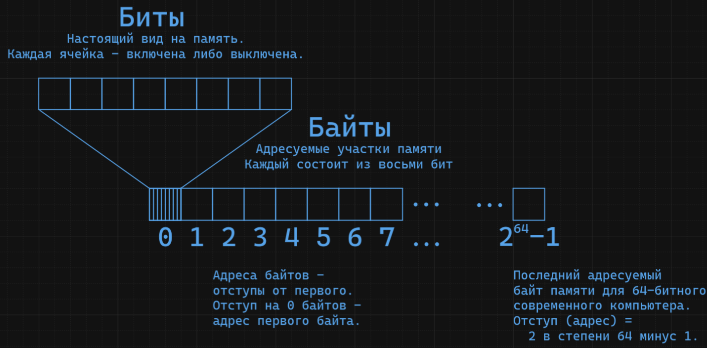

# C lecture conspect

#[c](c.md) #[lecture](lecture.md) #[teaching](teaching.md) #[programming](programming.md)

_Дисклеймер: всё что следует далее - это большая куча пиздежа (или, скорее, намеренных упущений) для простоты понимания. Многие из заданных понятий на деле состоят из нескольких составных частей и имеют исключения, нюансы в своих настоящих определениях/настоящей работе. Современные введения в программирование начинают с наивной "модельной" абстракции, задавая правила для работы с "моделью" оторванной от железа, тогда как это введение начинает с наивного взгляда на работу железа и низкоуровневой программной среды — операционной системы, задавая правила для работы с ними. В конечном итоге первый подход приводит к иллюзиям, замешательству и "магическому мышлению" у программистов, а данный, хоть и также начинается с наивного взгляда, отталкивается от реального положения дел и способствует интуиции в понимании работы **любых** программ на компьютере, и оставляет прямой путь для углублённого изучения._

---

Глоссарий:

- ОП - оперативная память
- ОЗУ - оперативное запоминающее устройство
- ЦПУ - центральное процессорное устройство
- железо - аппаратное обеспечение. Физические микросхемы, устройства
- софт - программное обеспечение. Программы для компьютера
- компилятор - прога которая переводит человекочитаемый язык в инструкции для ЦПУ
- число - абстрактный объект, представляющий собой количество чего-то
- цифра - символ из определённого набора символов, кодирующих числа, представляющие собой разряды в записи числа в позиционной системе счисления (см. ниже). Запись числа состоит из цифр.
- метаданные - данные о данных. Например метаданные программы: данные о самой программе.
- высокоуровневый - высокий уровень абстракции. Абстракция, построенная на абстракции, построенная на абстракции... вплоть до железа.
- низкоуровневый - низкий уровень абстракции. Условной первый уровень, максимально близкий к железу, или отсутствие её как таковой.
- эксплицитно - явно, прямо
- имплицитно - неявно, сокрыто
- дискретный - отдельный, несвязный; например клавиши клавиатуры - дискретны, нет значений «между» двумя соседними клавишами.
- имплементация - реализация
- арбитрарно - выбрано без критерия, по личному выбору
- аллокация - выделение, выделенная память
<!---->

- TODO: сделать шота со степенями/формулами в разметке
- TODO: 

## Введение

- Программирование - это задание инструкций компьютеру, как достичь необходимой цели.
- Компьютер - это настраиваемая машина, работающая точно как, как её настроят.
- Программируют компьютеры обычно на человекочитаемых формальных языках, переводимых готовыми программами в понимаемый компьютером язык, но любой такой язык одновременно в той или иной мере абстрактен, оторван от физической работы машины, и ограничен её физическим устройством.
- Из этого следует, что невозможно адекватно программировать компьютер, не понимая принципов его работы. Поэтому перед изучением языков необходим необходимо введение в физическое устройство компьютера и информатику на которой оно устроено, а также введение в устройство низкоуровневой программной среды компьютера - операционной системы.

### Дисклеймер / Предисловие

- Большая часть из следующей теории традиционно преподаётся _после_ абстрактного введения в алгоритмы и структуры данных, и изучения языка программирования высокого уровня абстрактности.
- Я считаю это ошибкой, из-за которой индустрия имеет несведущих программистов пишущих ужасно неэффективно работающий софт. **Лагающие программы, зависающие окна, краши и баги стали нормой, чем-то присущим компьютерам, а не недостатком качества.**
- Более того, из этой системы образования была взращена культура, не просто поощряющая незнание работы платформы - железа, а практически порицающая её изучение вне контекста специализации. В рамках этой культуры люди ведут себя так, как будто платформа на которой они работают - не железо, а софт, а понимать как работает железо не нужно, ведь оно настолько мощное, что мы можем позволить себе писать софт не для железа, а писать софт для софта, для софт-систем, реализующих "простые" и "практичные" абстракции поверх железа.
- В реальности эти системы приводят к нивелированию десятков лет развития железа, а натянутые друг на друга "простые" софт-системы становятся настолько сложными, что использовать их и писать для них без боли просто невозможно, тем не менее они являются стандартом индустрии
- Примерно до 2000-х годов это было не так, при том что само железо и как следствие софт фундаментально не поменялись, изменилась лишь система образования, настрой людей и статус кво.
<!---->
- Значительная часть из следующей теории не будет применена на практике в рамках этой лекции, и в рамках практики среднего программиста в целом.
- Никто не делает системный вызов используя вручную введённые процессорные инструкции, заполняя регистры и вызывая системное прерывание. Но я считаю это и другие следующие знания необходимым фундаментом, без которого всё что происходит в компьютере - магия.
<!---->
- Для читающих эту лекцию в тексте, особенно для начинающих с нуля, стена текста ниже скорее чем нет будет ошеломляющей.
- Скип этого раздела в теории возможен, но не рекомендуется. Раздел преподающий язык C ссылается на эту базу на каждом шагу. В теории можно читать раздел про C и пользоваться поиском по тексту введения по необходимости.
- Запомнить всё с одного прочтения также скорее невозможно чем да. Поэтому ожидается несколько перечитываний в процессе [изучения языка C](#язык-програмирования-c)

### Теория информации и её применение в компьютерах / "Информатика"

- **Информация** - абстрактное понятие, означающее что-то, что может иметь для наблюдателя смысл в каком-либо контексте.
- **Данные** - информация, которой придана форма, которую мы упорядочили в интересующем нас контексте. Например, конкретное математическое уравнение - это данные, а все возможные его другие преобразования и выводы из него, которые мы ещё не произвели - информация, закодированная в том же уравнении, но не данные.
- **Бит** - минимально физически возможная единица измерения информации, 2 дискретных состояния. Все компьютеры и микроконтроллеры используют его для мельчайшей ячейки памяти - заряжена/разряжена, вкл/выкл.
- **Байт** - арбитрарно выбранная единица адресации в ОП, ставшая стандартом индустрии, состоящая из восьми 1-битовых "ячеек", идущих подряд. Получить доступ к отдельному биту нельзя, только доступ к байту, в котором этот бит находится, следовательно - это минимально адресуемая единица. Почему 8? - Это не очень большая и не очень маленькая степень двойки, которые удобно использовать из-за двоичной системы счисления, следующей из использования битов, также как удобно использовать 10, 100, 1000... в десятичной.
- **Адрес** - отступ в байтах от начала ОП. У каждого байта в ОП есть "адрес", заключающийся в том, сколько ячеек нужно отступить начиная от первой.
- **Позиционная система счисления** — система счисления, в которой значение каждого числового знака (цифры) в записи числа зависит от его позиции (разряда). Позиционные **системы определяются числом-основанием**. Числа состоят из цифр, каждая цифра в числе по счёту начиная от нуля справа налево умножается на основание в степени своего номера по счёту.
- Нам привычно использовать десятичную систему: например, 101 в десятичной означает: `1*10^2 + 0*10^1 + 1*10^0`, то есть одна сотня (10^2) + ноль десятков (10^1) + одна единица (10^0). Десятичная система, разумеется, также включает в себя ещё 8 возможных состояний каждой цифры, всего 10, от 0 до 9 включительно. Считая натуральные числа в десятичной системе, мы сначала берём следующий символ в пределах одной цифры (0, 1, 2, 3, 4...), а после 9-и мы переводим "разряд" (степень) и записываем следующее по счёту число как 10 (один и ноль) и т.д.
- **Двоичная система счисления** - позиционная система счисления с основой 2. Это означает что у каждой цифры возможно лишь два состояния, набор возможных символов каждой цифры состоит из 0 и 1. 101 в двоичной означает: `1*2^2 + 0*2^1 + 1*2^0`, то есть одна четвёрка (2^2) + ноль двоек (2^1) + одна единица (2^0). Счёт в двоичной системе идёт как и в десятичной, но разряд переводится сразу после 1, т.к. больше состояний/символов у числа нет: 0, 1, 10, 11, 100, 101, 110, 111...
- Двоичная система счисления является естественной для памяти компьютера. Каждый байт по своей сути является восьми-цифровым числом с основой 2, в десятичной записи эти числа имеют значения от 0 до 255 (2^8-1), всего 256 возможных значений (2^8).
<!---->
- Помимо двоичной нас интересует **шестнадцатеричная**
- **Шестнадцатеричная система счисления** - система счисления с основой 16. Для её записи используют знаки 0-9 для первых десяти и знаки A-F для ещё шести значений.
- Шестнадцатеричная система **используется только для удобства в работе программистов**: один байт в двоичной записывается в 8 знаков/символов, а в шестнадцати лишь в 2. Например 255 в 10 = 11111111 в 2 или FF в 16. В быту эта система используется например для цветов в графических редакторах: #FF7F00 - полный красный + половина зелёного + нисколько синего = оранжевый, в памяти - по одному байту на каждый базовый цвет, 24 символа в двоичной, но всего 6 в шестнадцатеричной.

### Железо / Аппаратная архитектура

- Основное из чего состоит компьютер - **"память"** (ОП), и **"процессор"** (ЦПУ) который модифицирует эту память выполняя "инструкции"
- **Инструкции** - ограниченный набор пронумерованных действий предполагаемый его микросхемой
- Инструкции **одна за другой** считываются из памяти и **выполняются**. 
- **Всё что делают инструкции (и таким образом, всё что делает компьютер) - манипулируют памятью.**
- Процессор выполняет одну\* инструкцию раз в **такт**, такты происходят раз в фиксированный промежуток времени.
- Железо раз в такт интерпретирует определённые состояния памяти как действия которые нужно совершить, например вывод пикселя на экран (монитор), отправка сигнала по сетевому кабелю (сетевая карта), запись в память (процессор)
- **Память**, оперативная память, ОП - это "лента"/"список"/"массив" логически идущих подряд 1-битовых ячеек, объединяемых в адресуемые "байты" по 8 бит
- В современных (ближайшие 20? 30 лет?) компьютерах память, доступная процессорным инструкциям состоит из физический памяти отдельных устройств (регистры ЦПУ, основная память ОЗУ, память контроллера жёсткого диска, память сетевой карты и т.д.), объединённой в **"виртуальное" адресное "пространство"** - каждому устройству выделена в нём область, и инструкция записи в них приводит к изменению физической памяти соответствующего устройства.
- То что называют ОЗУ (RAM) - в рамках архитектуры компьютера играет роль "основной памяти" (main memory) компьютера.
- Одним из исключений в этой модели являются **"регистры"** ЦПУ - малочисленные встроенные в него ячейки очень быстрой памяти, предназначенные для временного хранения данных в моменте их обработки. Например, есть регистр хранящий адрес текущей инструкции в ОП, помимо других специализированных, а есть горсть регистров для произвольного использования. Регистры обычно являются частью инструкции, но зачастую для памяти регистров также выделяется область в адресном пространстве виртуальной ОП. Обычно с регистрами работает не программист, а компилятор, но знание об их существовании важно для дальнейшего объяснения.
- Регистры имеют "ширину" (размер) в битах соответствующую "битности" (архитектуре) компьютера. Обычно каждый сталкивался с понятиями 32-битных и 64-битных систем, 8-битных приставок из 80-х и т.д.
- **Адресное пространство** - буквально одномерное пространство, как одномерное пространство на числовой оси. Оно физически ограничено адресами от `0` до `2^64-1`, для современных 64-битных компьютеров, ведь размер регистров у них равен 64 битам (64 бита по 2 возможных состояния каждый, а адресация начинается с нуля, следовательно `-1`), а регистры помимо прочего используются для хранения адресов.
- Важно не путать "память" с "памятью на диске"/"постоянной" памятью (англ. memory и storage). Когда программист говорит по-русски "память", скорее всего он имеет ввиду именно "оперативную" (не постоянную, дисковую) память, использующуюся железом в работе, описанную выше.  Memory в английском _всегда_ означает ОП.

- \* - упущение, условность.

### Софт / Программное обеспечение / Программная архитектура

- **Программа**, в фундаментальном смысле - любая последовательность инструкций для процессора
- Программы считываются процессором из ОП
- Современные компьютеры основаны на архитектуре фон Неймана - данные и код находятся в одной и той же памяти, одном и том же адресном пространстве.
- По умолчанию инструкции программы выполняются одна за другой
- Адрес текущей инструкции хранится в специальном регистре - счётчике программы (Program Counter, PC)
- Основные инструкции, используемые в программах (далеко не исчерпывающий, но достаточный список):
    - Инструкция "перемещения" - `mov`, при помощи которой делается чтение+запись **из** адреса/регистра **в** адрес/регистр
    - Математические инструкции (сложение `add`, вычитание `sub`, умножение `imul`, деление `idiv` и т.д.)
    - Логические инструкции ("И" `and`, "ИЛИ" `or`, отрицание `not` и т.д.)
    - Инструкции "прыжка" на другую инструкцию (изменения адреса в регистре PC), **условные** и **безусловные**, позволяющие создавать **зацикленные программы**
    - Инструкции "прерывания" - `int` (interrupt), специальные инструкции для сигнала операционной системе что процессу что-то нужно (см. ниже)
    - Инструкции для работы со стеком - `push` и `pop` (см. ниже)
<!---->
- **Подпрограмма** - любая логически отдельная последовательность инструкций, являющаяся частью другой программы. Они предназначены для множественного использования в процессе работы программы посредством "прыжка" на их первую инструкцию и прыжка обратно после последней. Примером подпрограммы является подпрограмма, выводящая текст на экран.
<!---->
- **Прерывание** - сигнал для ЦПУ прервать текущее выполнение и передать управление (перевести PC на) подпрограмму-обработчик конкретного прерывания.
    - Прерывания бывают программными и аппаратными
    - Аппаратные прерывания вызываются железом, обычно устройствами ввода - мышкой, клавиатурой и т.д.
    - Программные прерывания вызываются программой эксплицитно, например для передачи работы операционной системе (см. ниже)
    - Обычно после выполнения подпрограммы-обработчика прерывания PC устанавливается обратно на адрес инструкции, на которой выполнение остановилось.
<!---->
- Запускать лишь одну программу на целом компьютере непрактично, а именно это предполагает его физическая архитектура. Программисты с годами построили стопку абстракций поверх прямых инструкций процессору, стоящих друг на дружке. Одним из первых слоёв этой стопки является **Операционная Система (ОС)**
- **Операционная Система (ОС)** - программа, предназначенная для запуска нескольких других программ, по очереди и/или одновременно.
- Помимо этого, операционная система предлагает набор встроенных программ, таких как файловая система
- Файловая система - система для организации контейнеров с данными для хранения на диске - файлов, организуемая программой на компьютере. Каждый файл хранит произвольные байты и считывается операционной системой с диска в ОП когда данные из файла необходимы.
- Большинство существующих программ написаны для работы поверх той или иной операционной системы
- "Одновременность" (конкурентность, concurrency) выполнения программ операционной системой это иллюзия - она выполняет инструкции "прыжка"/переключает Program Counter между несколькими программами настолько быстро, что для человека это выглядит как одновременное выполнение. Технически, процессор всё ещё выполняет ровно одну программу, просто "прыгая" с одной инструкции в памяти на другую, в бесконечном цикле.
<!---->
- Термин "программа" в контексте программы написанной для операционной системы приобретает иной, более сложный смысл:
    - Программа, в смысле программы в операционной системе - специальный формат файла, "исполняемый" формат.
    - Для сравнения, другие привычные для пользователя компьютера форматы включают
        - Текстовый (последовательность байтов, каждый из которых или каждые N из которых означают какой-то символ для отображения на экране, согласно таблице кодировки символов)
        - PNG - картинка ("заголовок" - фиксированное количество байтов с метаданными + байты цветов пикселей для отображения на экране)
    - Формат программы (исполняемого файла) в современных ОС выглядит состоит из следующих частей (не исчерпывающий, но достаточный список):
        - Заголовок - фиксированное количество байт под метаданные, в т.ч. о секциях описанных далее
        - Секция данных - произвольное количество байт, выделенные программистом для нужд программы. Секция данных логически состоит из участков статического, фиксированного размера, но определённого программистом.
        - Секция "текста" - произвольное количество байт, содержащих процессорные инструкции.
        - (опционально) Таблица "символов" - таблица символьных человекочитаемых названий участков секции данных - **подпрограмм**.
<!---->
- Программы в ОС считываются ей из файла в ОП для выполнения их инструкций.
- ОС организует одновременно выполняемые ей программы в **"Процессы"**
- **Процесс** - структура данных в ОС, кодирующая программу в очереди на выполнение. ОС хранит список (очередь) процессов в ОП. Эта структура состоит из (опять же, не исчерпывающий список):
    - Имени файла, из которого считана программа
    - Параметров запуска
    - Секции данных, считанной из исполняемого файла. Это так называемая **статическая память** (Static memory) - память, которая доступна на протяжении всего жизненного цикла процесса до его завершения.
    - Секции текста, считанной из файла. ОС передаёт процессору эти инструкции когда подходит очередь данного процесса.
    - Секции "стека" (Stack). Это секция памяти фиксированной длины, логически разделённая на ячейки фиксированной "ширины" (размера), ровно по ширине процессорного регистра - так называемый **стек**. Для работы с этой секцией выделены отдельные процессорные инструкции - push и pop, и регистр - указатель на стек (Stack Pointer, SP), хранящий адрес первого байта текущей ячейки.
        - `push` записывает указанное значение из указанного регистра или адреса в текущую логическую ячейку согласно SP и переводит адрес в SP на адрес первого байта следующей логической ячейки
        - `pop` делает обратное - записывает значение из ячейки согласно текущему SP в указанный регистр или адрес, и переводит адрес в SP на первый байт предыдущей ячейки.
    - Секции "кучи" (Heap) / Динамических аллокаций. У этой секции нет фиксированного размера или лимита, при запуске программы эта секция пуста, и она предназначена для произвольного пополнения во время выполнения программы. Программист может использовать системные вызовы (см. ниже) для запроса у ОС выделения (аллокации) памяти в эту секцию, получая логические секции произвольных размеров, от одного байта. Это так называемая **динамическая память**.
<!---->
- Программы в ОС сами по себе **не могут делать ничего "интересного"** в следствии отсутствия "прав" на запись по адресам, память которых управляет вводом/выводом, звуком, сетью и т.д.
- ОС ограничивает доступ процессора ко всем адресам кроме адресов из выделенной процессу памяти при "прыжке" на инструкцию в его секции кода, при помощи механизмов, находящихся за рамками этой лекции.
- Для обхода этого ограничения используются специальные инструкции программных прерываний (software interrupts, инструкция `int`), которые предназначены для передачи контроля ОС и совершения **системных вызовов**.
- **Системные вызовы** - это набор подпрограмм, предоставляемых ОС, которые делают что-то с внутренним состоянием ОС или указывают ОС сделать что-то с железом.
- Для совершения системного вызова нужно записать его номер и аргументы в регистры, определённые операционной системой, и вызвать определённое прерывание.
<!---->
- TODO: диаграммы для всей этой хардварно-софтварной хуйни блядь

## Язык программирования C

TODO(C): алфавит, синтаксис, возможные конструкции, какие инструкции из них следуют

### Теория ЯП

- **Язык программирования** (ЯП) - это искусственный, формальный язык, предназначенный для перевода программой в процессорные инструкции.
- Как и любой естественный язык, языки программирования состоят из **алфавита**, **слов** составленных из него, и **предложений** составленных из слов
- Предложения и целые тексты записанные на языке программирования, как и машинные инструкции называют **кодом**.
<!---->
- Как и у любого естественного языка, порядок слов в предложениях на ЯП следует чётко определённому **синтаксису**.
- **Синтаксис** - это порядок слов и структура этого порядка в предложениях языка.
    - Синтаксис языка строит структуру **дерева** - вложенных составных частей предложения.
<!---->
- Как и у любого естественного языка, слова и предложения на языках программирования имеют **семантику**.
- **Семантика** - это значение слов, словосочетаний и предложений.
<!---->
- Синтаксис и семантика - это то, что определяет язык.
<!---->
- ЯП делятся на **императивные** и **декларативные**.
    - Семантика **Декларативных** ЯП заключается в описании конечного результата, который необходим в следствии работы программы. Такие языки по своей сути абстрактны, высокоуровневы и оторваны от железа, и конкретные инструкции программы необходимые для достижения описанной цели определяются программой-интерпретатором.
    - Семантика **Императивных** ЯП заключается в точном описании шагов, необходимых для достижения конечного результата, который необходим в следствии работы программы. Такие языки по могут быть как очень высокоуровневыми, где сами шаги/"инструкции" языка высокоуровневы, так и очень близкими к физическим процессорным инструкциям.
<!---->
- ЯП переводятся программой машинные инструкции. Такая программы делятся на **интерпретаторы** и **компиляторы**.
    - **Интерпретатор** - это программа которая интерпретирует код на ЯП, то есть извлекает семантику, и генерирует соответствующие инструкции, передавая их на выполнение по ходу интерпретации.
    - **Компилятор** - это программа, содержащая в себе интерпретатор, но вместо запуска сгенерированных инструкций записывающая их в программу ОС - исполняемый файл, для последующего запуска.
<!---->
- Исходя из вышесказанного выделяют два типа времени в процессе разработки программы - Время компиляции и Время работы - **Compile time** / **Run time**. Подробнее ниже.

### Из чего состоит любой императивный ЯП

- Основной синтаксис и семантика большинства императивных языков примерно одинаковы.
- Если ты знаешь один язык, начать писать почти на любом другом можно за вечер.
- Основные семантические концепты, имплементируемые почти любым ЯП, включают:
    - **Типы данных** (Data types)
    - **Переменные** (Variables)
    - **Операторы** (Operators)
    - **Условные** конструкции (Conditionals)
    - **Циклы** (Loops)
    - **Подпрограммы** / **Процедуры** / **Функции** (Subroutines / Procedures / Functions)
<!---->
- Основные синтактические конструкции, имплементируемые почти любым ЯП, включают:
    - **Утверждения** (Statements) (по-русски обычно называют "операторами")
    - **Выражения** (Expressions)
    - **Литералы** (Literals)
    - **Символы** (Symbols) (важно - не путать с символами в смысле текстовые символы)
    - **Вызовы функций** / **Функторы** (Function applications)
<!---->
- **Типы данных**
    - Программе необходима память для хранения данных. Как описано выше память бывает выделенной статически, выделенной на стеке и выделенной динамически.
    - Память как таковая это сплошная последовательность байт
    - Для организации данных в этой последовательности байт, она делится на логические участки.
    - Логические участки в свою очередь в рамках ЯП имеют **Тип данных**.
    - **Тип данных** - **соглашение** как хранить, как структурировать и как использовать данные в одном из таких логических участков.
    - Размер логического участка всегда зависит от его типа данных, разный для одного и того же типа в зависимости от ЯП.
    - Основные типы данных включают:
        - **Целое** число **со знаком** (unsigned **integer**)
        - **Целое** число **без знака** (signed **integer**) (не имеет отрицательных)
        - Дробное число / "Число **с плавающей запятой**" (**floating** point numbers) (всегда имеют отрицательные)
        - **Логический** / **Булев** тип (boolean / bool) - лишь два возможных значения - истина либо ложь, вкл либо выкл, ровно так, как ведёт себя бит. Необходим для логических операций и условий. Булев тип придумал, внезапно, математик Джордж Буль.
        - **Символ** / Знак (character / char) - символ в той или иной кодировке.
        - **Массив** (array) - несколько экземпляров одного типа лежащие в памяти подряд.
        - **Строка** (string) - массив символов.
        - **Указатель** (pointer) - адрес байта.
- **Переменная** - это имя, данное логическому участку памяти.
    - Переменные всегда **имеют тип данных**.
    - Переменные бывают изменяемыми и нет, что указывается вовремя **объявления** переменной.
    - Пример: переменная `score` типа integer, хранящая счёт игрока в игре.
- **Оператор** (Operator) - это, чаще всего, математическая операция.
    - Операторы бывают бинарными и унарными.
    - Примеры бинарных операторов: `+` в `2+2`, `-` в `1000-1`, `<` в `3<4`
    - Примеры унарных операторов: `-` в `-2` - отрицает положительное число 2.
    - Не путать со Statement: в русском языке используется также в этом смысле.
- **Условная конструкция** (Conditional) - это конструкции, разделяющие код на 2 возможных пути выполнения.
    - Пример: Если в текущем кадре нажата кнопка, то открыть диалоговое окно
    - Пример: Если `score > 100` вывести "Вы победили", иначе вывести "Вы проиграли"
- **Цикл** (Loop) - это последовательность инструкций, заканчивающая прыжком на своё начало.
    - Завершённые проходы по циклу называются итерациями.
    - Циклы бывают **с условием** и **со счётчиком**.
    - Цикл с условием выполняется до тех пор, пока логическое (булево) условие истинно.
    - Цикл со счётчиком является надстройкой над циклом с условием; он предназначен для тех циклов, когда мы используем переменную-счётчик, считающую, сколько итераций пройдено, с условием на определённое количество итераций.
- **Подпрограммы** / **Процедуры** / **Функции** (Subroutines / Procedures / Functions)
    - Термин **подпрограмма** уже определён в данном тексте. Он означает участок кода предназначенный для множественного переиспользования.
    - Адрес на первую инструкцию подпрограммы сохраняется в **переменной**, то есть у подпрограмм есть **имя**.
    - **Процедура** - это подпрограмма, которая может принимать **аргументы** и может **возвращать** результат.
    - Процедура может не принимать аргументов и/или не возвращать результата.
    - **Функция** - это процедура, которая всегда принимает и возвращает результат, и не делает ничего кроме математических вычислений.
    - В современной индустрии термины процедура функция **используются синонимично**, означая процедуру. Чаще всего употребляется термин "функция", но термин "процедура" более корректен.
    - Использование процедуры называется её **вызовом** (Call).
    - **Аргументы** (Arguments) - это параметры запуска для процедуры. Например: подпрограмма `print` выводящая текст на экран, принимает аргументом текст.
    - **Возвращение** (Return) результата - это передача вычисленного значения-результата работы подпрограммы вызывающей её программе.
        - Например: подпрограмма `print` выводящая текст на экран, принимает аргументом текст.
<!---->
- **Утверждение** (Statement) - это любая "верхнеуровневая" конструкция в языке.
    - Утверждение для ЯП является тем же, чем инструкция для ЦПУ
    - По-русски это обычно называют "операторами", что создаёт неоднозначность в терминологии
    - Утверждения могут содержать внутри себя другой тип конструкции - **выражения**.
- **Выражение** (Expression) - это часть утверждения, которая представляет из себя, по сути, математическое выражение, некий расчёт, результирующий в значении.
    - Выражения состоят из литералов, символов и вызовов функций.
- **Литерал** (Literal) - это "буквально" записанное значение в выражении.
    - Одинокий литерал - тоже выражение.
    - Синтаксис основных литералов зависит от языка, но как правило по большей части идентичен.
    - На примере языка C, примеры литералов:
        - Целочисленные литералы: `2`
        - Дробные литералы: `2.5`
        - Булевы литералы: `true`, `false`
        - Знаковые литералы: `'a'`, `'b'`
        - Строковые литералы: `"hello"`, `"Merry christmas!"`
- **Символ** (Symbol) - это имя переменной, использованное в выражении.
    - Важно - не путать с символами в смысле текстовых символов - character(s)
    - Одинокий символ - тоже выражение.
- **Вызовы функции** / **Функтор** (Function application) - это использование специального оператора "вызова" на символе.
    - Одинокий вызов функции - тоже выражение.
    - Вызов функции также может быть утверждением, если нам не нужно получать результат её вычислений.
    - Пример вызова: `print("Hello World")`
- Примером утверждения и выражения является `a = 2 + 2`.
    - `a = 2 + 2` - утверждение присваивания переменной `a` некоего значения.
    - `2 + 2` - выражение, являющееся частью этого утверждения.
    - Будет произведено вычисление выражения `2 + 2`, и в итоге в память переменной `a` будет записано значение `4`.
- Ещё пример: `length = sqrt(x*x + y*y)`.
<!---->

<!---->

### Введение в C

- Язык C - императивный язык и традиционно считается одним из самых низкоуровневых языков, на уровень выше прямого программирования процессорными инструкциями
- Несмотря на это, разница в уровне абстракции между C и популярными "более простыми" языками значительно ниже, чем разница между C и сырыми процессорными инструкциями.
- C очень прост как язык, и достаточно прост в практическом применении, будучи при этом достаточно близким к железу для написания высокопроизводительного софта и железо-ориентированного изучения программирования. **Сложность C переоценена.**
- Важно различать языки C и C++. В современной IT среде принято писать их через слеш, как "C/C++", и делать вид будто между ними нет большой разницы, а C++ это строгое и совместимое улучшение поверх языка C. И хотя C++ действительно изначально создавался как лишь небольшая надстройка над и модернизация C, этот язык отошёл далеко от него. C++ *значительно* более сложен, более *комплексен* чем C, и наполнен сомнительными дизайн-решениями, от которых не может избавиться в угоду обратной совместимости.
<!---->

### ???

- Показать статическую переменную
- Показать запись в переменную и использование переменной

- Показать стековую переменную в рамках функции

- TODO: диаграмма: дерево синтаксиса предложения
